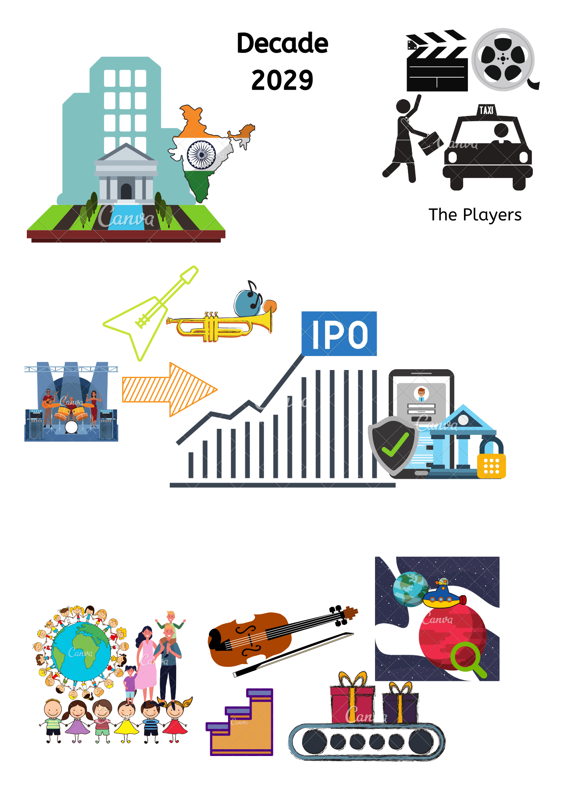

<!-- Still working out the exact format for this but it will include:
* The 'Comics' as I envisioned them at the time
* An updated version to reflect ones that were completed (tick) or removed (no longer necessary)
* Some reference or indication of the amount of time everything took (to get better at predicting)

But my gut tells me that the volume/significance of what we achieve (in a post-information age) is more limited by the ability to visualise what we truly want, more so than seeking time-based 'Agile' optimisations (although, of course, there are productivity ceilings that might need to be overcome e.g. by hiring more sales people). -->

My strategic planning cheat sheet adapted from the book "Playing To Win" [is here](../assets/img/p2w-min.jpg)

## 2020

### Q4 Sep-Nov

### Q3 June-Aug

### Q2 March-May 

### Q1 Dec-Feb [view](../assets/img/21jan.png)

*** 

## Year

### 2021

***

## Decade 

***

## Streets Ahead

There are no shortage of ideas, but the question is whether it can all be achieved within the time.

<!-- Life in Weeks Glitch applet to condense information space -->