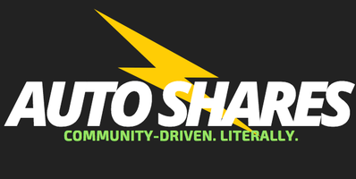

<!-- <link rel="stylesheet" href="https://stackpath.bootstrapcdn.com/bootstrap/4.3.1/css/bootstrap.min.css" integrity="sha384-ggOyR0iXCbMQv3Xipma34MD+dH/1fQ784/j6cY/iJTQUOhcWr7x9JvoRxT2MZw1T" crossorigin="anonymous"> -->

<!--   Testing...-->

## Welcome 
 
You've stumbled onto Nick L. Theodorou's website (that's me). 
 

Here for Tech Wednesday? <a href="https://docs.google.com/presentation/d/e/2PACX-1vQu298lKk37yakLkwXmPC8SOLjgLo1PzgLUVuZrNPWhnrSjhH1m1EFfm7warW5YI_MqfIuSRKX1vWvt/pub?start=false&loop=true&delayms=15000"> Here are the Slides </a>📲 

<!-- [Jump to my Portfolio Projects](#Portfolio) -->
 
If you're here to review some of my past work go here -> [Jump to my Portfolio Projects](#Portfolio)   
 
Otherwise just peruse at your leisure, get a flavour for what my motivations and inclinations are then, if you like what you see, I encourage you to become a valued newsletter subscriber - with your support this contact list will always serve as my first launch channel for getting early feedback for new creations that will grow into something big and impactful [Sign up here](#mailing)
 

***

<!-- Discover one of my projects (clickable): -->

<!-- (clickable pics):  -->
<!-- 3 or 12/4 Columns -->

<!--   -->

<!--  -->

<!-- Tinkerbricks 
[Cyprus] Solar Club [Subdomain] -->
<!-- Cloud Flare CDN -->
<!-- I'm Feeling Lazy [Show me a video summary!](http://invidio.us)  -->

<!-- ## What is this 'Nikipedia' thing anyway?

The foundation of communication involves making assumptions about what other people know. I assume you can read English, or have access to a browser-extension that can translate this page for you. My main point is that 'knowledge clouds' exist between us, and in order for us to make  significant scientific progress in the future we will need to communicate more efficiently. The only other options are increasing the lifespan in which to make progress, or increasing the 'information bandwidth' in which to achieve. This 'personal knowledge cloud' is the low-tech solution for my half of the communication problem. Although in essence I started it almost 30 years too late to become a 'real-time' reflection, Nikipedia is an ongoing repository of 'time-series data' that mirrors the path of intellectual things I choose to explore / exploit.

***

Hi, My Name is Nick or Νικόλαος in Greek.
I wanted an easily-accessible place to share my projects and knowledge so I created this open source project.
The idea is this: 
- (Almost) every day I will write/think aloud/plan in a way that feels natural for me.
- Sometimes those writings will be worth 'refactoring' into their own document/project.
- I will polish / present those projects into something more coherent and reader-worthy here, on the first page.
- Finally, I will link between documents (html web pages) that I have personally generated in a wiki-like way --

-- to a) to serve as a firm foundation for my descendents to also build on top of (should I be so lucky!), and
b) to test my own understanding as I develop personal 'reference documentation'.
Continued maintenance of this project is also my personal fight against early-onset Alzheimer's, and it is likely one day some big data summaries could be extracted from the text files.

It is not enough to read and study; you must create and solve. [Jump to what I'm Aiming to solve](#aims)  
 -->

 

## Aims
<!-- Age 2 I pick out the right numbers for my grandma. We won the lottery and I got to grow up in the right environment and get the right education.
Like an obsessive-compulsive I spent my entire waking life orientated towards one ideal, in the same way Chris Hadfield chose to eat is vegetables from age 6 because he believed it would make him more likely to become an astronaut(!) -- for me that ideal was more of a 'feeling' and that feeling was to 'search' for the roots of what drives humanity forward - and then contribute to it.   -->

What I have decided to work on:

- The Future of Renewable Energy and Income-generation [Energy Independence](./Energyindependence.md)
- The Future of Food Waste Management and Income-generation [Larvae Labs](./Labs.md)
- The Future of Transportation and Income-generation [Auto-Shares](./autoshares/autoshares.md) 
- The Future of Immersive Learning and Wellness
<a href="https://biota.me/" target="_blank"> biota.me </a>

<!-- 
- The Future of Immersive Education and Skill you guessed..!) 

- Intermittent / necessary entrepreneur-ing (aka paying the bills)

_Hmm Watson, there's a common theme afoot_ -> That's right, but it'll be better to explain after you see it in action and working.
 -->

 
I settled on the unifying brand name TinkerBricks, and don't worry there's only one thing being tackled at any given time (but alot of parallel working led me into believing these are all essential as well as valuable ideas, therefore I should not let them go, even if other teams should take them over).

 

### TinkerBricks logo

 
 
_Red = Transport, Yellow = Energy, Blue  = Health  Education, Green = Food_

<!-- The link / QR Code to download the App will go here.
 -->

  

### Progress on Aims

As a visual person I like to plan ahead and keep track of progress in the form of Comic-like pictures. I call it "Visual Accountability".
It beats re-reading a long, complicated plan when I have already thought through the project milestones (although full write-ups are available on request).
They can serve as a visible cue to keep you focused, but also create reference cues to more easily communicate progress between teammates and stakeholders.

<!-- class="btn btn-info" -->

* [Visual Accountability Comics](./autoshares/visual_accountability.md)
 <button type="button" onclick="window.location.href = './autoshares/visual_accountability.html';">View Comic</button>

 
### Now Page

 See [nikipedia.xyz/now](https://nikipedia.xyz/now)

***
 
## Software product & project manager For Hire 

 
I worked with companies large and small usually as the "bridge" between software developer and management teams. If you have a product vision but are unsure about where to go next to make it happen (and not get fleeced) I'm certainly worth approaching for at least an initial (free) consultation.

<!-- consider any opportunities relating (even very loosely) to my Aims - the four themes that relate my 'jigsaw puzzle' to create one thriving TinkerBricks House per neighbourhood of 20,000 people.  -->

<!-- 
Directing teams to develop Customer Relationship Management software ([which I have done](https://youtu.be/d_M9h4Ndxts)), studying Physics to Masters' level, or gaining 2-3 years employment in an advanced technology development setting, are all necessary and relevant experiences that come with the journey of achieving my Aims. In short: don't be shy, hire me. 
 -->

A good place to reach me directly is Twitter. DMs are open :)
<a href="https://twitter.com/nicktheodorou?ref_src=twsrc%5Etfw" class="twitter-follow-button" data-show-count="false">Follow @nicktheodorou</a>

 
Alternatively you can reply to the mailing list confirmation email (after you join it, obviously).

<!-- Downloadable CV with email capture / sent to your email ex mailinator, and/or simply linkedIn - with has pixel tracking anyway
 -->
 

***

 

### Mailing list

<form style="border:1px solid #ccc;padding:3px;text-align:center;" action="https://tinyletter.com/nickth" method="post" target="popupwindow" onsubmit="window.open('https://tinyletter.com/nickth', 'popupwindow', 'scrollbars=yes,width=800,height=600');return true">
<label for="tlemail">Enter your email address</label>

<input type="text" style="width:140px" name="email" id="tlemail" />
<input type="hidden" value="1" name="embed"/><input type="submit" value="Subscribe" />
<a href="https://tinyletter.com/nickth" target="_blank">The Future of XYZ</a>
</form>

If you want to join the friends and internet onlookers
consider signing up with your best email address, doing so is exceedingly appreciated.

***

 

## Portfolio Projects (Semi-Chronological)

Gifs _from the future_ will be added from time to time. 

 
 
 
 
 

This space is reserved to showcase my most recent work.

***

## Independent projects:

 
*My design of a Search Engine for YouTube captions*
 

LAMP Stack - Data-Driven 140 Line Twitter Clone  
<!-- 
[Check it out here](http://tweetdemo.tinkerbricks.co/) -->

Algorithmia - Trained AI that rotates Photos for 'Horizon-correction' written in Python  
[Check it out here](https://youtu.be/Gtc-aU-nG5g)

IBM Watson / Twilio - Telephony App that you phone to tell it your Symptoms and it responds with medical Advice ("Dr Watson")

Twilio / Zapier / Sheets - Send an email by typing a phone number in the Subject. Receive a call that reads out the body text. ("Robo Caller" - purely to learn, not to spam!).  
To expand on this idea I used Yet Another Mail Merge and Google Sheets to automate and generalise the Robo Caller's abilities

Dialog Flow (api.ai) - Rough prototype of a Facebook Messenger chatbot designed to serve as "your Personal Recruitment Consultant". Launched the idea on Product Hunt under the brand name Emissary [by Persona Ltd, my company at the time]. Pitched to Nathan Bowles CEO, Smart Recruitment

Twilio - Setup a Toll-free number that routes to an office landline for Smart Recruitment

Unity - Immersive VR world with Animations and Teleportation, compatible with a range of headsets and WebVR 

Sketch / Principle - High-fidelity Mockups for a mobile-first YouTube Captions Search application. I then edited a 'vlog' style video documenting the process. FYI - the final half of this video covers an unrelated project (called Auto-Shares)   
[Check it out here](https://www.youtube.com/watch?v=yM6DIXmob8A&feature=youtu.be) - x1.5 playback speed advised

Progressive Web Apps - Deployment of a _beautiful_ sample Books search app, idea is to swap out the Google Books API for Youtube Video results using Audio Transcription Microservice + a TFIDF algorithm written in Python

Glide - Ported a collection of public domain audio files into a step-by-step language learning course (App-based), includes a chat feature to find fellow students to practise with, and a [dummy] directory of local 1-to-1 language tutors. Also works as a Chrome App.  
[Check it out here](https://wthwy.glideapp.io/)

Ethereum / Solidity / Metamask - Deployed my own smart contract to the Test Network to prototype an idea by Warren Buffett using my own "Bit of Nick" Tokens 

Typeform / Zapier / Trello - Built my own JustEat-style menu and order tracking system for my Dad's restaurant [to save their commission fees]

Typeform Zapier Trello + Stripe + AdWords - Used a similar 'Stack' to the JustEat-clone and prototyped a new startup idea in 4 days to test business viability and Unit Economics. Started generating sales.

Xcode / Unity - Experimented with Apple's newly released AR Kit to create an iOS app that demonstrates Augmented Reality

<iframe width="560" height="315" src="https://www.youtube.com/embed/YpGqMYtjz8M" frameborder="0" allow="accelerometer; autoplay; encrypted-media; gyroscope; picture-in-picture" allowfullscreen></iframe>

***

## Startups & Team efforts

Although it's just a glimpse, all in all these 2 projects took up 4 years of my life, but they gave me 'first hand know-how' about of what a professional business person could expect - I chaired a board, raised venture captial, encounters with famous entrepreneurs _and that jazz_.

 

Persona Jobs :

<iframe width="560" height="315" src="https://www.youtube.com/embed/2SUyHcx_PJ4" frameborder="0" allow="accelerometer; autoplay; encrypted-media; gyroscope; picture-in-picture" allowfullscreen></iframe>

 

NTech Solutions : 

<iframe width="560" height="315" src="https://www.youtube.com/embed/d_M9h4Ndxts" frameborder="0" allow="accelerometer; autoplay; encrypted-media; gyroscope; picture-in-picture" allowfullscreen></iframe>

***

## Pre-Graduation:

Lua - Wrote scripts for programming Keithley Machines to measure POWER / I-V Curves of Dye Synthesized Solar Cells of any size by sweeping Current and Voltage

Mathematica - Managing Packages and a Notebook to visualise the efficiency of Dye Synthesized Solar Cells under fluorescent and outdoor light sources (Measuring the Shockley-Queisser limit) 

CLI / Unix Commands - Submitting Particle-in-Cell plasma simulation jobs to UCL's Super Computing Cluster (HPC)

MATLAB - Solving Equations of Motion for a Double Pendulum; Creating Time Lapse visualisations of Proton-Driven Plasma Wakefields

Processing - Arduino-controlled Data Visualisation [In future I could run this type of project directly in a web environment]

Meteor.js - Setting up Telescope (a hacker news clone); Login with Twitter / a Conference Attendee App

C++ - Use of Statistics libraries written by CERN to analyse example results data, Glen Cowan was my instructor

LaTeX - My _beautifully_ typeset Masters' Thesis on Plasma Wakefield Acceleration (Thanks Donald Knuth)  
[Check it out here](https://www.amazon.co.uk/Beyond-Large-Hadron-Collider-Particle-ebook/dp/B076PXBTQ7)

### Original motivations

My Parents and Grandparents were in the Food Retail trade (specifically takeaway Fish & Chips) so as a teen I was unboundedly curious to demystify the heights of word "Business".
I wanted to be able to viscerally relate to it (specifically the word) through first-hand experiences and in a world not already known to me, i.e. in places that are far less obvious than a shop. 
<!-- For similar reasons I picked a Final year project that involved running simulations on a super computer - because the concept of doing that seemed so foreign to me that I just had to expand my awareness by diving in, even though the Lab projects also seemed _super_ interesting I could imagine what it would involve. -->
 
And for the longest time my other fascination has been invention(s) - intially it was about the creative expression and buzz you get from coming up with 'new' ideas and considering their commercial ability -- but there's so much more to it. It's a pragmatists' pursuit, and often relies on savvy to overcome the financial constraints. And it involves careful study -- getting to grips with the work of others already done (and be waiting to be re-discovered or re-mixed into a new form).

<!-- - I guess for me it's a form of creative expression to conceive of ideas, and that's just the easy bit!
Critiquing and interrogating the commercial promise   -->

<!-- This speaks to the point I made about "Hatters" (i.e. "Fish Fryers") and the less tangibly obvious role of Knowledge Workers behind the scenes -- I needed the concreteness of all these first-hand experiences in order to better relate to what makes the modern world tick. -->

 

***

## Niki's Wiki

<!-- "If you know a topic well enough you could have written the Wikipedia article"
 
This isn't really true because it would be a Herculean effort. -->

Nikipedia is a personal web of articles that reflects the state of my knowledge about a given topic.

  The idea is to make incremental improvements to serve as a metacognizant restatement of what I have learnt. (And although I always joke that this writing practise is a coping strategy for my impending Alzheimer's, the truth is I think alot of life-long students are practising in a form of 'willfull amnesia', which is a huge source of time-waste that should be avoided. 
 
YOURNAME-ipedia would do the same job and _thanks to Git and version control_ if many other people adopted this as a standard we could compare the side-by-side topic misconceptions, similarities, breadth, or depths of understanding.
 
Currently, misconceptions may be buried and might never be given the opportunity to surface and corrected by teachers. 

<!-- 
Essentially this is something I started doing on [Dropbox Paper](http://bit.ly/39WwyEj), then I switched to thinking about it in terms of a shareable github repo (starting with a portion of this here website), at some point I thought that an audio / definition format could be interesting ([Listen here](https://anchor.fm/nikipedia-xyz)), however I see Immersive Learning as another emerging medium for me to investigate. Ultimately the focus is for better use of technology to train up the next generation of engineers to a world-class standard more efficiently.

For some topics I decided to record an [Unlisted Video](./wiki/unlisted_videos.md) 🏁
Other topics warrant a full write up (when it is worthwhile to do so), and certain topics like the inner workings of magnetism should be supplemented with fabled _Immersive Interactive Experiences_ -->

Here is a list of concepts I have been exploring or recapping: 

* [Quantum Error Correction](./wiki/QuantumErrorCorrection.md) 🏁
* Fermi Surfaces 🏁
* Formal Logic 🏁
* Combinators 
* Industrial uses for Protein folding solutions
* [Gyroscopes](./wiki/Gyroscopes115.md) 🏁

Health-related:

* [Sulforaphane](./wiki/Sulforaphane.md) 🏁

### Write-ups

See [nikipedia.xyz/writeups](https://nikipedia.xyz/writeups)  
This is section is for longer form creative writing.  

<!--    
(click the logo to access this portal) 
 -->

<!-- To start your own personal "Nikipedia-like" project:
 
* 1) Click the very first button at the top of this page, 
* 2) fork this Repo on Github, rename it the same as your Github username (in the same way I did with mine), this will give you a hosted website
* 3) replace my content with yours, style it however you like (optional), then tell me it exists (I would love to check it out)
 
Same instructions go for Collaborating on my wiki entries / Correcting anything I wrote, plus
 
* 4) commit the changes you made to a separate git branch, then open a Pull request on Github 
 
Here are a list of folders within this website repo that I am willing to accept Pull Requests about:
 
* ./wiki
* ./auto-shares -->

<!-- * ./tinkerbricks (tbc)
* ./solarclub (tbc)
* ./Just-The-Script.com (tbc)
* ./Alternate-Realities-visitorbook (tbc)
* ./Reunification-project (tbc)
* ./BSFL (tbc) -->

<!-- 
 
Before I accept a Pull Request (in the spirit of this entire project) I will need time to demonstate the claim that your changes are now _actually_ part of my own personal knowledge repetoire -- to ensure that this website doesn't simply become a pale pale version of actual Wikipedia.
 
If _everything_ ends up staying in this one repo (apparently that is how GOOGLE genuinely manage their entire code base), then for some projects/folders Containerisation will be essential ^^
 
Similarly, for any larger media items, these "files" (like audio etc.) will merely be http links that point to their actual location on a CDN. 
 -->

***

### Videos

Finally, I'll leave you with a perspective-changing short video....or a much longer one. 
 
FYI after watching the second one it will make sense to tell you my "principle" is:  
Critique your chosen inputs to strive for desired outputs. 

<iframe width="560" height="315" src="https://www.youtube-nocookie.com/embed/fW8amMCVAJQ" frameborder="0" allow="accelerometer; autoplay; encrypted-media; gyroscope; picture-in-picture" allowfullscreen></iframe>

<iframe width="560" height="315" src="https://www.youtube-nocookie.com/embed/8QiPFmIMxFc?start=1401" frameborder="0" allow="accelerometer; autoplay; encrypted-media; gyroscope; picture-in-picture" allowfullscreen></iframe>

<!-- When it would be necessary / useful include a search tool -->

<!-- List of links to other projects, Just the Script,  etc.  -->

 
Thanks for stopping by :)
 

<!-- ***
Featured skill of the month:

***

I can prototype interactive designs in FramerX

 -->

***

&copy; Nick L. Theodorou MMXX - Heat Death of the Universe (or, you know, until copyright expiry moves my work into the public domain)

<!--  -->
