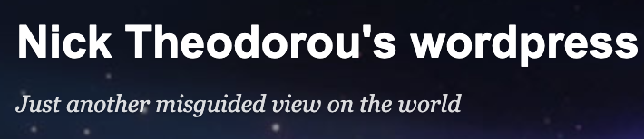

On Desktop you can use links on the left hand side see older write ups (reverse chronological):

***

### 18th December 2021

 
<!--  -->

***

### 23rd October 2021



***



***

### 28th April 2021 

<!-- ### Start included file -->



<!-- ### End included file -->

***

 

  
<a href="https://nicktheodorou.wordpress.com/" target="_blank"> Click to visit my Wordpress Blog back from those student days</a>

 

[Go to Homepage](https://nikipedia.xyz/)